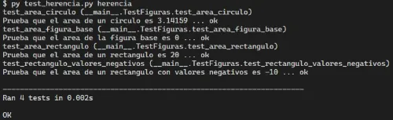

# Actividades Propuestas

## Tabla de Contenido

- [Actividades Propuestas](#actividades-propuestas)
  - [Tabla de Contenido](#tabla-de-contenido)
  - [Encapsulamiento](#encapsulamiento)
    - [Ejecución correcta de pruebas unitarias](#ejecución-correcta-de-pruebas-unitarias)
  - [Herencia](#herencia)
    - [Ejecución correcta de pruebas unitarias](#ejecución-correcta-de-pruebas-unitarias-1)

## Encapsulamiento

En la carpeta `ejercicios\encapsulamiento` en esta misma ruta, se encuentra el archivo llamado **encapsulamiento** en el cual deberás crear una clase **Producto** que tenga un atributo privado `__precio`. Implementa métodos para:

- Establecer el precio (debe ser llamado set_precio), solo si es mayor que cero.

- Obtener el precio (debe ser llamado get_precio).

Ejemplo de implementación esperada:

```py
p = Producto()
p.set_precio(1500)
print(p.get_precio())  # Debe mostrar 1500

p.set_precio(-200)     # No debe modificar el precio
```

Una vez hayas creado la clase y sus métodos, deberás ejecutar los test unitarios para validar correctamente la implementación. En la consola de comandos deberás ejecutar el siguiente comando posicionado en dicha ruta:

```
py test_encapsulamiento.py encapsulamiento
```

Una vez hayas realizado la actividad puedes visualizar una posible solución en el archivo ubicado en esta ruta: [`1_programacion_orientada_a_objetos/soluciones/encapsulamiento/solucion.py`](./soluciones/encapsulamiento/solucion.py)

### Ejecución correcta de pruebas unitarias

Si has aprobado todos los test unitarios, se debería mostrar lo siguiente en consola:


## Herencia

En la carpeta `ejercicios\herencia` en esta misma ruta, se encuentra el archivo llamado **herencia** en el cual deberás crear una clase base Figura con un método area() (que debe retornar 0 por defecto). Luego, crea dos clases que hereden de ella:

- Clase Rectangulo, con atributos ancho y alto.

- Clase Circulo, con atributo radio.

Ambas deben sobrescribir el método area() para devolver el área correspondiente.

Una vez hayas creado la clase y sus métodos, deberás ejecutar los test unitarios para validar correctamente la implementación. En la consola de comandos deberás ejecutar el siguiente comando posicionado en dicha ruta:

```
py test_herencia.py herencia
```

Una vez hayas realizado la actividad puedes visualizar una posible solución en el archivo ubicado en esta ruta: [`1_programacion_orientada_a_objetos/soluciones/herencia/solucion.py`](./soluciones/herencia/solucion.py)

### Ejecución correcta de pruebas unitarias

Si has aprobado todos los test unitarios, se debería mostrar lo siguiente en consola:


