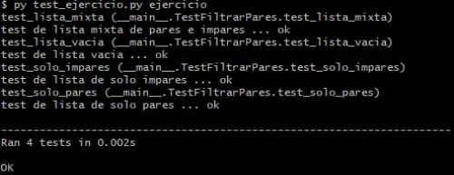
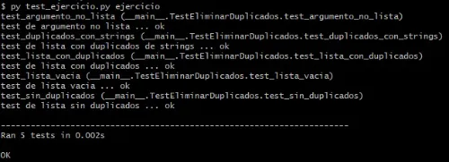
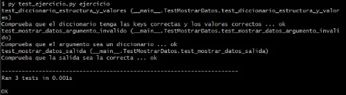

# Actividades Propuestas

## Tabla de Contenido

- [Actividades Propuestas](#actividades-propuestas)
  - [Tabla de Contenido](#tabla-de-contenido)
  - [Ejercicio 1: Filtrado de Listas](#ejercicio-1-filtrado-de-listas)
    - [Ejecución de tests unitarios](#ejecución-de-tests-unitarios)
  - [Ejercicio 2: Eliminar duplicados de lista conservando el orden](#ejercicio-2-eliminar-duplicados-de-lista-conservando-el-orden)
    - [Ejecución de tests unitarios](#ejecución-de-tests-unitarios-1)
  - [Ejercicio 3: Creación de diccionario y recorrido](#ejercicio-3-creación-de-diccionario-y-recorrido)
    - [Ejecución de tests unitarios](#ejecución-de-tests-unitarios-2)
  - [Soluciones](#soluciones)

## Ejercicio 1: Filtrado de Listas

En el archivo `ejercicios/1_filtrado_listas/ejercicio`, crea una función llamada `filtrar_pares` que reciba una lista de números enteros y retorne una lista solo considerando los elementos pares.

### Ejecución de tests unitarios

Una vez finalices el ejercicio deberás ejecutar los test unitarios para verificar tu respuesta. Posicionado en la ruta `ejercicios/1_filtrado_listas`, ejecuta el siguiente código en la consola de comandos:

```
py test_ejercicio.py ejercicio
```

Si has aprobado todos los tests, entonces se debe mostrar el siguiente output en la consola:



## Ejercicio 2: Eliminar duplicados de lista conservando el orden

En el archivo `ejercicios/2_eliminar_duplicados_preservando_orden/ejercicio`, crea una función llamada `eliminar_duplicados` que reciba una lista como parámetro y que permita eliminar los elementos duplicados pero conservando el orden.

### Ejecución de tests unitarios

Una vez finalices el ejercicio deberás ejecutar los test unitarios para verificar tu respuesta. Posicionado en la ruta `ejercicios/2_eliminar_duplicados_preservando_orden`, ejecuta el siguiente código en la consola de comandos:

```
py test_ejercicio.py ejercicio
```

Si has aprobado todos los tests, entonces se debe mostrar el siguiente output en la consola:



## Ejercicio 3: Creación de diccionario y recorrido

En el archivo `ejercicios/3_creacion_diccionario_recorrido/ejercicio`, crea un diccionario llamado `cliente` con las siguientes keys: `edad`,`nombre`, `ciudad` y los siguientes valores respectivos: 25, 'Luis', 'Santiago'. Posteriormente, pasa el diccionario a la función `mostrar_datos` y utilizando un bucle crea el siguiente string: "Cliente Luis, 25 años, de Santiago".

### Ejecución de tests unitarios

Una vez finalices el ejercicio deberás ejecutar los test unitarios que verifican si tu solución es válida. Debes posicionarte en la ruta `ejercicios/3_creacion_diccionario_recorrido` y ejecutar el siguiente código en la consola de comandos:

```
py test_ejercicio.py ejercicio
```

Si has aprobado todos los tests, entonces se debe mostrar el siguiente output en la consola:



## Soluciones

Las soluciones a los ejercicios anteriores se encuentran en la carpeta `soluciones` en la misma ruta de este archivo.
