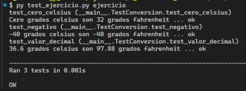
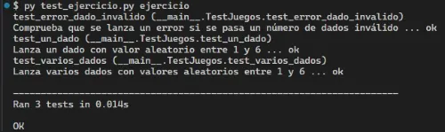

# Actividades Propuestas

## Tabla de Contenido

- [Actividades Propuestas](#actividades-propuestas)
  - [Tabla de Contenido](#tabla-de-contenido)
  - [Ejercicio 1: Función para convertir grados Celsius a Fahrenheit](#ejercicio-1-función-para-convertir-grados-celsius-a-fahrenheit)
    - [Ejecución de tests unitarios](#ejecución-de-tests-unitarios)
  - [Ejercicio 2: Función para lanzar n dados](#ejercicio-2-función-para-lanzar-n-dados)
    - [Ejecución de tests unitarios](#ejecución-de-tests-unitarios-1)

## Ejercicio 1: Función para convertir grados Celsius a Fahrenheit

En el archivo `ejercicios/1_conversion_celsius/ejercicio.py` crea una función llamada `celsius_a_fahrenheit` que convierta grados celsius a fahrenheit.

### Ejecución de tests unitarios

Una vez finalices el ejercicio deberás ejecutar los test unitarios para verificar tu respuesta. Posicionado en la ruta `ejercicios/1_conversion_celsius`, ejecuta el siguiente código en la consola de comandos:

```
py test_ejercicio.py ejercicio
```

Si has aprobado todos los tests, entonces se debe mostrar el siguiente output en la consola:



## Ejercicio 2: Función para lanzar n dados

En el archivo `ejercicios/2_lanzar_dados/ejercicio.py` crea una función llamada `lanzar_dados` que dado el ingreso de un número n de dados retorne una lista con valores aleatorios entre 1 y 6. Para ello utiliza un `import` de la librería `random`.

### Ejecución de tests unitarios

Una vez finalices el ejercicio deberás ejecutar los test unitarios para verificar tu respuesta. Posicionado en la ruta `ejercicios/2_lanzar_dados`, ejecuta el siguiente código en la consola de comandos:

```
py test_ejercicio.py ejercicio
```

Si has aprobado todos los tests, entonces se debe mostrar el siguiente output en la consola:


