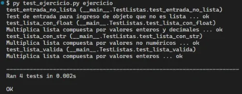

# Actividades Propuestas

## Tabla de Contenido

- [Actividades Propuestas](#actividades-propuestas)
  - [Tabla de Contenido](#tabla-de-contenido)
  - [Ejercicio 1: Multiplicar números de lista por un factor](#ejercicio-1-multiplicar-números-de-lista-por-un-factor)
    - [Ejecución de tests unitarios](#ejecución-de-tests-unitarios)
  - [Ejercicio 2: Obtener el valor de un diccionario a partir del clave](#ejercicio-2-obtener-el-valor-de-un-diccionario-a-partir-del-clave)
    - [Ejecución de tests unitarios](#ejecución-de-tests-unitarios-1)

## Ejercicio 1: Multiplicar números de lista por un factor

En el archivo `ejercicios/1_multiplicar_lista/ejercicio.py` crea una función llamada `multiplicar_lista` que permita solo el ingreso de una lista de números y un número como factor donde el primer parámetro corresponde a la lista y el segundo parámetro corresponde al factor. Si no se cumple lo anterior ya sea no se ingresa una lista o la lista ingresada posee algún elemento que no es número entonces lanza la excepción de tipo `TypeError`.

### Ejecución de tests unitarios

Una vez finalices el ejercicio deberás ejecutar los test unitarios para verificar tu respuesta. Posicionado en la ruta `ejercicios/1_multiplicar_lista`, ejecuta el siguiente código en la consola de comandos:

```
py test_ejercicio.py ejercicio
```

Si has aprobado todos los tests, entonces se debe mostrar el siguiente output en la consola:



## Ejercicio 2: Obtener el valor de un diccionario a partir del clave

En el archivo `ejercicios/2_obtener_valor_diccionario/ejercicio.py` crea una función llamada `obtener_valor` que permita el ingreso de dos parámetros donde el primer parámetro debe corresponder a un diccionario y el segundo parámetro debe ser la clave que se desea consultar. Si el primer parámetro no es un diccionario se debe lanzar una excepción del tipo `TypeError`. Además, la función debe retornar el valor asociado a la clave si esta existe, y en caso contrario, lanzar una excepción del tipo `KeyError` con un mensaje personalizado.

### Ejecución de tests unitarios

Una vez finalices el ejercicio deberás ejecutar los test unitarios para verificar tu respuesta. Posicionado en la ruta `ejercicios/2_obtener_valor_diccionario`, ejecuta el siguiente código en la consola de comandos:

```
py test_ejercicio.py ejercicio
```

Si has aprobado todos los tests, entonces se debe mostrar el siguiente output en la consola:


