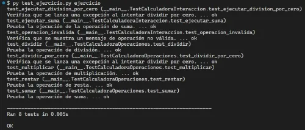

# Actividades Propuestas

## Tabla de Contenido

- [Actividades Propuestas](#actividades-propuestas)
  - [Tabla de Contenido](#tabla-de-contenido)
  - [Ejercicio 1: Creación de Calculadora](#ejercicio-1-creación-de-calculadora)
    - [Ejecución de tests unitarios](#ejecución-de-tests-unitarios)

## Ejercicio 1: Creación de Calculadora

En el archivo `ejercicios/1_calculadora/ejercicio.py` construye un programa que simule una calculadora básica donde cada operación (suma, resta, multiplicación y división) debe estar definida como una función diferente llamada `sumar`,`restar`,`multiplicar` y `dividir`, respectivamente . Luego, crea una función principal llamada `ejecutar_calculadora` que le pregunte al usuario qué operación desea realizar ingresando el nombre de la función y la ejecute. Si se ingresa una operación diferente a las 4 anteriores, se debe imprimir el siguiente mensaje `Operación no válida.`

### Ejecución de tests unitarios

Una vez finalices el ejercicio deberás ejecutar los test unitarios para verificar tu respuesta. Posicionado en la ruta `ejercicios/1_calculadora`, ejecuta el siguiente código en la consola de comandos:

```
py test_ejercicio.py ejercicio
```

Si has aprobado todos los tests, entonces se debe mostrar el siguiente output en la consola:


