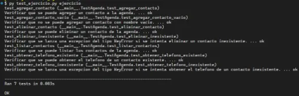

# Actividades Propuestas

## Tabla de Contenido

- [Actividades Propuestas](#actividades-propuestas)
  - [Tabla de Contenido](#tabla-de-contenido)
  - [Ejercicio 1: Agenda de Contactos Básica](#ejercicio-1-agenda-de-contactos-básica)
    - [Ejecución de tests unitarios](#ejecución-de-tests-unitarios)

## Ejercicio 1: Agenda de Contactos Básica

En el archivo `ejercicios/1_agenda/ejercicio.py`, debes crear una pequeña aplicación que permita guardar, buscar y eliminar contactos usando un diccionario. Cada contacto tendrá un nombre (clave) y un número de teléfono (valor). Para ello deberás crear una clase llamada **Agenda** la cual deberá poseer los siguientes métodos:

- `agregar_contacto`: debe poseer dos parámetros donde el primer parámetro es es nombre y el segundo parámetro es el teléfono. Si el nombre o el télefono no son pasados como argumento, entonces debe lanzarse una excepción del tipo `ValueError`. Se debe agregar a un diccionario de contacto, el nombre asociado al teléfono en minusculas.

- `obtener_telefono`: debe poseer un parámetro que corresponde al nombre. Si el nombre no existe en el diccionario de contactos, entonces lanzar una excepción del tipo `KeyError`.

- `eliminar_contacto`: debe poseer un parámetro que corresponde al nombre. Si el nombre no existe en el diccionario de contactos, entonces lanzar una excepción del tipo `KeyError`. Si existe en el diccionario de contactos, entonces se debe eliminar el par.

- `listar_contactos`: no debe poseer parámetros. Debe permitir retornar el diccionario ordenado por sus claves.

### Ejecución de tests unitarios

Una vez finalices el ejercicio deberás ejecutar los test unitarios para verificar tu respuesta. Posicionado en la ruta `ejercicios/1_agenda`, ejecuta el siguiente código en la consola de comandos:

```
py test_ejercicio.py ejercicio
```

Si has aprobado todos los tests, entonces se debe mostrar el siguiente output en la consola:


